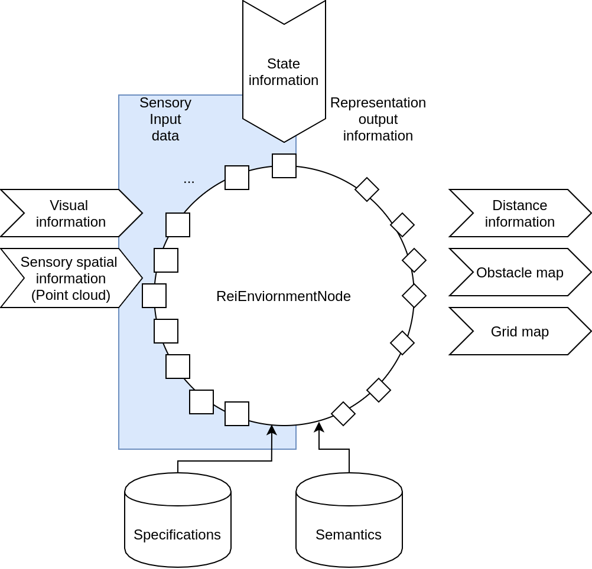

# REI Environment representation

## Concept
Represent the environment for a robot (or a vehicle) through distributed set of nodes. The representation should be extendable with filtering abilities and providing output for other nodes (e.g. motion planning).
In this setup a full environment representation is a subgraph of the communication graph. Each node represents a semantic segment of the environment space. In some extent, it is a sensory fusion method, to represent information. This perception node is a subcomponent of the monitoring ecosystem closely related to the motion planning problem.

## Environment perception requirements
A chain of nodes represent the semantic result from sensory input data. This subgraph should always relate to a specific target instance, like a robot. A subgraph should be able at least to provide the following data:
- Distance of the target to any object in the representation.
- Provide (semi-)structured output to the robot.
- Provide robot physical constraints based on vehicle semantics.

A single node represents a filtered segment of the environment, in a special way it can define the global and local environment map. With the in-memory solutions of ROS/ROS2 with a common interface it is a convineient and reusable way to do. In general a node can have _n_ inputs of different types and _m_ predfined outputs, with mandatory __state__ input.

A single node realizes operations such as merging and filtering sensory data. A __node__ can be configured to provide the following data:
- Environment map of different semantics (e.g. collision map, social map) and different representation (e.g. occupancy grid, polymap, octree)
- A single node is configured to read from state representation (result of localization) and different sensory sources.

A __merging node__ represents the fusion of sensory sources, like merging pointcloud information with obstacle data.

A __filtering node__ represents the processing of (partial) information represented by the architecture.

## Communication between targets
The subgraphs are enabled to exchange information. 

This is not yet a detailed subject.